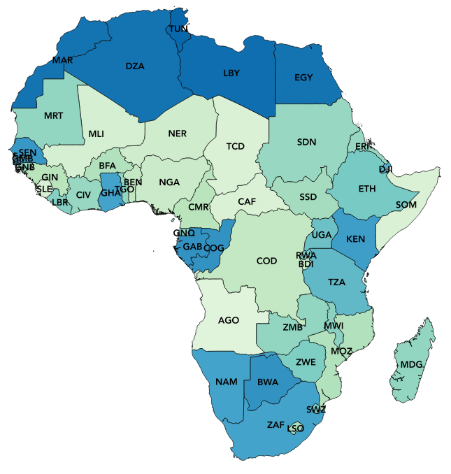

# Africa Child Health

Data and R code to reproduce analyses examining socio-economic and environmental determinants of child-health outcomes among African nations

Accompanies the paper: Bradshaw, CJA, SP Otto, AA Annamalay, S Heft-Neal, Z Wagner, PN Le Souëf. 2019. Testing the socio-economic and environmental determinants of better child-health outcomes in Africa: a cross-sectional study among nations. <em>BMJ Open</em> 9: e029968. doi:<a href="http://doi.org/10.1136/bmjopen-2019-029968">10.1136/bmjopen-2019-029968</a>

<strong>Contact</strong>: Professor Corey J. A. Bradshaw  
http://globalecologyflinders.com  
<a href="mailto:corey.bradshaw@flinders.edu.au">e-mail</a>

03 September 2019

## Main R script
<code>AfricaCountryChildHealthGithub.R</code>

## Data files
The following files can be found in the <a href="https://github.com/cjabradshaw/AfricaChildHealth/tree/master/data">data</a> subdirectory:

- arableland.csv
- cc2to3.csv
- childhealthmetrics.csv
- cntry.num.code.csv
- continent.country.csv
- country.centroids.csv
- country_level_pm25.rds
- cropland.csv
- EFconsPC12.csv
- exclbreastfedAFR.csv
- exportvalue.csv
- HME_DAH_DATABASE_1990_2015_Y2016M04D25.CSV.zip
- PPP11.15.csv
- WHO.cntry.csv

Note, you must unzip the file 'IHME_DAH_DATABASE_1990_2015_Y2016M04D25.CSV.zip' within the same directory to access the .csv file with the R script

## Source files
- <code>new_lmer_AIC_tables3.r</code>
- <code>r.squared.R</code>
